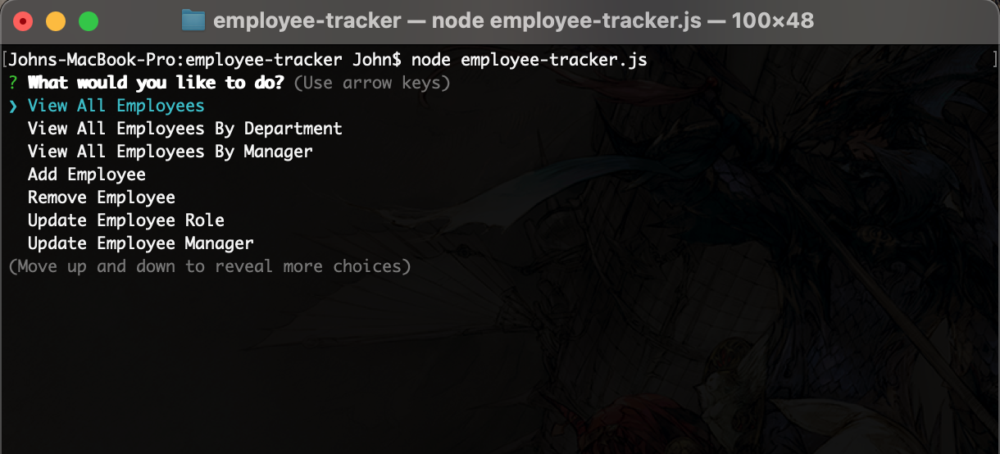
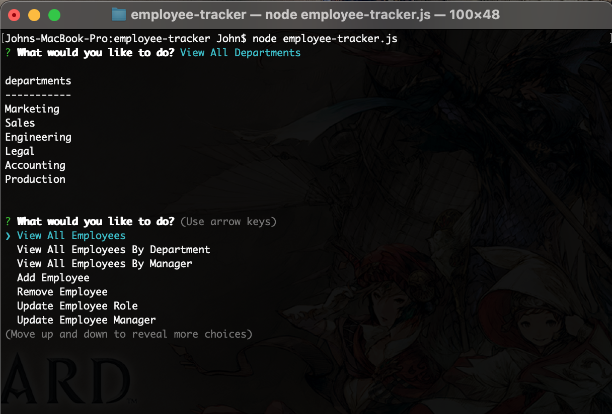
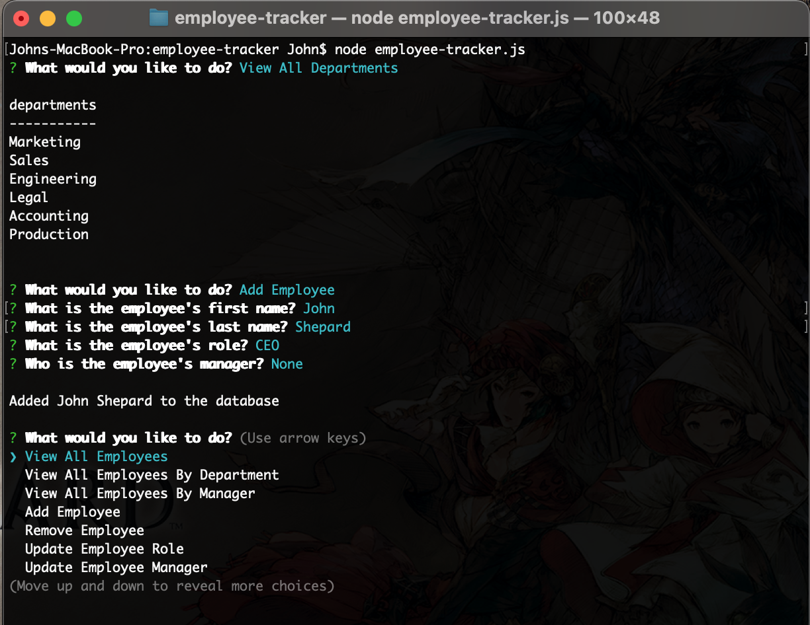

# employee-tracker

## Description

    An employee manager command-line application that  
    modifies information stored in a mysql database.

## Installation

Download the files from [my repo](https://github.com/takolad/employee-tracker).
This application requires **Node.js** to run.
In a *command-line interface* (PowerShell, CMD, Terminal) run `node -v` to see if Node is already installed, if not it can be downloaded from [Node.js](https://nodejs.org/en/download/).

## Usage

To use this application first have the associated directory,  
**employee-tracker**, as your *working directory*.  
First run `npm install` to install dependencies, set up your  
database information in the environement settings in  
a *.env* file (check sample) placed in the root of **employee-tracker**.
Then type `node employee-tracker` OR `npm start` to run the application.  
Navigate the menu with the `arrow` keys and press `enter` to make a selection.

## Screens
   
   
   

## Links
   [Demonstration Video](https://drive.google.com/file/d/1rXZiSQCESwKmk9AjySs8Bpy1MEkOm9vS/view?usp=sharing)

## License

   
   [MIT License](https://opensource.org/licenses/MIT)